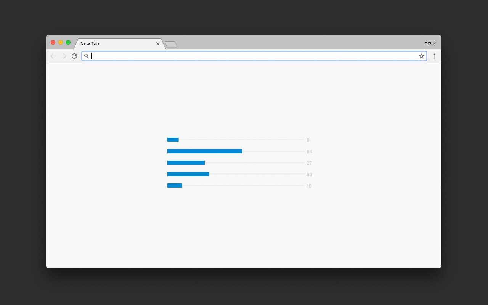

# Making Progress - A Time Tracking Chrome Extension
Making Progress is a new tab extension for google chrome, designed to allow you to track your time and progress in a minimal way. With progress bars for your hour, day, week, month, and year, the user can choose how much or how little information they want to see every time they start a new tab.

See more at [ryderdamen.com](http://ryderdamen.com/making-progress)
Download it [in the chrome store](http://ryderdamen.com/making-progress)

## Dependencies
* Progress Bar from  [progressBar.js](https://kimmobrunfeldt.github.io/progressbar.js/)
* Options Page "Saved" notification from [notify.js](https://notifyjs.com/)